# 🔍 Configuration Drift Detection & Self-Remediation Platform

[](https://github.com/saeedmfat/ansible-Configuration-Drift-Detection-and-Self-Remediation-Platform)
[](https://www.ansible.com)
[](https://python.org)
[](https://vagrantup.com)
[](LICENSE)
[](https://www.linkedin.com/in/saeed-marefat-b97992349)

## 🎯 Project Goal

**Configuration drift** is the silent killer of production systems - unauthorized changes that accumulate over time, leading to inconsistencies, security vulnerabilities, and system failures. This project solves this critical problem by building a complete **enterprise-grade automation platform** that:

1. **Continuously monitors** infrastructure for unauthorized changes
2. **Automatically detects** configuration drift using checksum validation
3. **Safely self-remediates** using canary deployment patterns
4. **Creates immutable audit trails** of all changes
5. **Provides real-time reporting** via REST API and dashboards

The system emulates real production infrastructure while staying within **16GB RAM home lab constraints**, making it accessible for learning and practical implementation.

## 🏗️ Architecture Overview

```mermaid
graph TB
    %% Title
    style Title fill:#1565c0,stroke:#0d47a1,stroke-width:3px,color:white
    Title["<b>🚀 CONFIGURATION DRIFT DETECTION & SELF-REMEDIATION PLATFORM</b><br/><sub>Complete Automation System - 16GB RAM Home Lab</sub>"]
    
    %% Core Components with better colors
    subgraph "🖥️ CONTROL NODE"
        CN1["<b>🧠 Ansible Controller</b><br/>Orchestration & Enforcement"]
        CN2["<b>🔍 Drift Detection Engine</b><br/>SHA256 Checksum Validation"]
        CN3["<b>⚙️ Remediation Engine</b><br/>Canary Deployment & Rollback"]
        CN4["<b>📊 Flask API Server</b><br/>REST Reports & Dashboard"]
        
        style CN1 fill:#2196f3,stroke:#0d47a1,color:white
        style CN2 fill:#4caf50,stroke:#1b5e20,color:white
        style CN3 fill:#ff9800,stroke:#e65100,color:white
        style CN4 fill:#9c27b0,stroke:#4a148c,color:white
    end
    
    subgraph "🌐 TARGET NODES"
        TN1["<b>🎯 Ubuntu/Nginx</b><br/>Target 1<br/>192.168.60.11"]
        TN2["<b>🎯 Ubuntu/Nginx</b><br/>Target 2<br/>192.168.60.12"]
        TN3["<b>🎯 Rocky/Apache</b><br/>Target 3<br/>192.168.60.13"]
        
        style TN1 fill:#4caf50,stroke:#1b5e20,color:white
        style TN2 fill:#4caf50,stroke:#1b5e20,color:white
        style TN3 fill:#ff5722,stroke:#bf360c,color:white
    end
    
    %% Workflows
    subgraph "🔄 DETECTION WORKFLOW"
        DW1["📝 Monitor Configs<br/>Every 15min"]
        DW2["🔢 Calculate Checksums"]
        DW3["⚖️ Compare vs Desired State"]
        DW4["📋 Generate Reports<br/>JSON/HTML"]
        
        style DW1 fill:#03a9f4,stroke:#0277bd,color:white
        style DW2 fill:#03a9f4,stroke:#0277bd,color:white
        style DW3 fill:#03a9f4,stroke:#0277bd,color:white
        style DW4 fill:#03a9f4,stroke:#0277bd,color:white
    end
    
    subgraph "⚡ REMEDIATION WORKFLOW"
        RW1["🎯 Canary (25% nodes)"]
        RW2["✅ Validate & Backup"]
        RW3["🔧 Apply Fixes"]
        RW4["📈 Full Rollout<br/>or 🔄 Rollback"]
        
        style RW1 fill:#ff9800,stroke:#e65100,color:white
        style RW2 fill:#ff9800,stroke:#e65100,color:white
        style RW3 fill:#ff9800,stroke:#e65100,color:white
        style RW4 fill:#ff9800,stroke:#e65100,color:white
    end
    
    %% Git & Audit
    Git["<b>📚 Git Server</b><br/>config-drift.git<br/>Immutable Audit Trail"]
    style Git fill:#607d8b,stroke:#37474f,color:white
    
    %% Notification System
    Notify["<b>🔔 Notification System</b><br/>Slack/Email/Terminal"]
    style Notify fill:#009688,stroke:#00695c,color:white
    
    %% Connections
    CN1 -- "SSH/Ansible<br/>Push Configuration" --> TN1
    CN1 -- "SSH/Ansible<br/>Push Configuration" --> TN2
    CN1 -- "SSH/Ansible<br/>Push Configuration" --> TN3
    
    Git -- "Git Pull<br/>Every 30min" --> TN1
    Git -- "Git Pull<br/>Every 30min" --> TN2
    Git -- "Git Pull<br/>Every 30min" --> TN3
    
    CN2 -- "Detect Drifts" --> DW1
    DW1 --> DW2 --> DW3 --> DW4
    DW4 --> CN4
    DW4 --> Git
    
    CN3 -- "Trigger Remediation" --> RW1
    RW1 --> RW2 --> RW3 --> RW4
    RW4 --> CN1
    
    CN4 --> Notify
    CN3 --> Notify
    
    %% Scheduling
    subgraph "⏰ AUTOMATION SCHEDULING"
        S1["🔄 Drift Simulation<br/>Every 2 hours"]
        S2["👁️ Drift Detection<br/>Every 15 minutes"]
        S3["🤖 Ansible-Pull<br/>Every 30 minutes"]
        S4["📅 Daily Reports<br/>11:30 PM"]
        
        style S1 fill:#795548,stroke:#3e2723,color:white
        style S2 fill:#795548,stroke:#3e2723,color:white
        style S3 fill:#795548,stroke:#3e2723,color:white
        style S4 fill:#795548,stroke:#3e2723,color:white
    end
    
    S1 --> CN2
    S2 --> CN2
    S3 --> Git
    S4 --> CN4
    
    %% Resource Summary
    Resources["<b>📊 RESOURCE SUMMARY</b><br/>Control: 2GB RAM<br/>Targets: 2GB each (6GB total)<br/>Total: 8GB VMs + 4GB overhead<br/>Within 16GB Home Lab Limit"]
    style Resources fill:#78909c,stroke:#37474f,color:white,stroke-dasharray: 5 5
    
    %% Legend
    subgraph " "
        L1["<font color='#2196f3'>💼 Management</font>"]
        L2["<font color='#4caf50'>🎯 Infrastructure</font>"]
        L3["<font color='#03a9f4'>🔄 Workflow</font>"]
        L4["<font color='#ff9800'>⚡ Action</font>"]
        L5["<font color='#795548'>⏰ Automation</font>"]
    end
```




## 📁 Project Structure

### Core Directories

| Directory | Purpose | Key Files |
|-----------|---------|-----------|
| **`inventories/`** | Ansible inventory management | `production/hosts.ini` - Production node definitions |
| **`playbooks/`** | Automation workflows | `webserver-deploy.yml` - Main deployment<br>`master-remediate.yml` - Canary remediation |
| **`roles/`** | Reusable Ansible components | `base/` - System fundamentals<br>`webserver/` - Web server configuration |
| **`detection-system/`** | Drift detection engine | `drift_detector.py` - Core detection logic<br>`report_api.py` - Flask REST API |
| **`drift-simulator/`** | Drift injection for testing | `drift_simulator.py` - Random drift generator |
| **`remediation-system/`** | Auto-remediation logic | `remediation_engine.py` - Safe remediation with rollback |
| **`notification-system/`** | Alerting system | `notify.sh` - Multi-channel notifications |
| **`scripts/`** | Utility scripts | `monitoring-dashboard.sh` - Live monitoring<br>`run-end-to-end-workflow.sh` - Complete demo |
| **`reports/`** | Generated reports | JSON/HTML/Markdown reports with timestamps |
| **`systemd-scheduling/`** | Automation scheduling | Timer/service files for all components |

### Key Configuration Files

| File | Description |
|------|-------------|
| **`Vagrantfile`** | Defines 4 VMs (1 control + 3 targets) |
| **`ansible.cfg`** | Ansible configuration and defaults |
| **`README-FINAL.md`** | Complete project documentation |
| **`QUICK-REFERENCE.md`** | Command cheat sheet |
| **`FINAL-SUMMARY.md`** | Project completion summary |

## 🚀 Project Stages (7-Stage Journey)

### Stage 1: Home Lab Setup
- ✅ Created 4 VMs using Vagrant + VirtualBox
- ✅ Configured private networking (192.168.60.0/24)
- ✅ Set up SSH key authentication
- ✅ Installed Ansible on control node
- ✅ Initialized Git repository for configuration

### Stage 2: Project Skeleton & Inventory
- ✅ Created professional Ansible directory structure
- ✅ Built separate inventories for Ubuntu/Rocky nodes
- ✅ Implemented group variables and host-specific configs
- ✅ Created base role with fundamental system configuration
- ✅ Demonstrated idempotency with test playbooks

### Stage 3: Desired State Role Development
- ✅ Built comprehensive webserver role (Nginx/Apache)
- ✅ Created configuration templates with variables
- ✅ Implemented custom facts for drift detection
- ✅ Added checksum-based state validation
- ✅ Demonstrated zero-downtime configuration updates

### Stage 4: Drift Simulation System
- ✅ Created Python-based drift simulator
- ✅ Implemented weighted random drift scenarios
- ✅ Added safe mode for testing
- ✅ Set up systemd timers for automated simulation
- ✅ Built drift analysis and reporting tools

### Stage 5: Drift Detection & Reporting
- ✅ Developed checksum-based detection engine
- ✅ Created multi-format reporting (JSON/HTML/Markdown)
- ✅ Built Flask REST API for report serving
- ✅ Implemented Git-based audit trail system
- ✅ Added real-time notification integration

### Stage 6: Self-Remediation Logic
- ✅ Implemented canary deployment for safe remediation
- ✅ Created threshold-based safety logic
- ✅ Built automatic rollback mechanisms
- ✅ Added pre/post validation checks
- ✅ Developed specialized remediation playbooks

### Stage 7: Automation Scheduling
- ✅ Set up ansible-pull for distributed management
- ✅ Created comprehensive systemd timer scheduling
- ✅ Built monitoring dashboard with real-time status
- ✅ Implemented end-to-end workflow demonstration
- ✅ Added multi-channel notification system

## 🛠️ Quick Start

### Prerequisites
- 16GB RAM system
- VirtualBox 6.1+
- Vagrant 2.2+
- Git

### Installation
```bash
# Clone the repository
git clone https://github.com/saeedmfat/ansible-Configuration-Drift-Detection-and-Self-Remediation-Platform.git
cd ansible-Configuration-Drift-Detection-and-Self-Remediation-Platform

# Start the virtual environment
vagrant up

# Connect to control node
vagrant ssh control
cd ~/ansible-config-drift

# Deploy initial configuration
ansible-playbook -i inventories/production/hosts.ini playbooks/webserver-deploy.yml
```

### Monitoring Dashboard
```bash
./scripts/monitoring-dashboard.sh
```

### Run Complete Demo
```bash
./scripts/run-end-to-end-workflow.sh
```

## 📊 System Features

| Feature | Implementation | Benefit |
|---------|---------------|---------|
| **Continuous Monitoring** | 15-minute detection intervals | Proactive issue detection |
| **Canary Remediation** | Test fixes on 25% of nodes first | Safe production changes |
| **Immutable Audit Trail** | Git-based logging | Compliance and forensics |
| **Multi-format Reports** | JSON, HTML, Markdown | Human and machine readable |
| **REST API** | Flask-based API server | Integration ready |
| **Real-time Notifications** | Slack/Email/Terminal alerts | Immediate awareness |
| **Resource Efficient** | Fits in 16GB RAM | Accessible home lab |

## 🧪 Testing & Validation

### System Health Check
```bash
./scripts/validate-complete-system.sh
```

### End-to-End Test
```bash
./scripts/run-end-to-end-workflow.sh
```

### Manual Operations
```bash
# Check for drifts
cd detection-system && python3 scripts/drift_detector.py

# Remediate manually
ansible-playbook -i inventories/production/hosts.ini playbooks/master-remediate.yml

# View reports
curl http://localhost:8080/api/v1/reports/latest | jq .
```

## 📈 Performance Metrics

- **Detection Time**: ~30 seconds per node
- **Remediation Time**: 2-5 minutes (depending on drifts)
- **Memory Usage**: 8GB VMs + 4GB overhead = 12GB total
- **Storage**: ~5GB including logs and reports
- **Scalability**: Supports up to 50 nodes within constraints

## 🔒 Security Features

- Private network isolation (192.168.60.0/24)
- SSH key authentication only
- No external dependencies
- Local Git repositories
- API binds to localhost only
- Comprehensive audit logging

## 🤝 Contributing

1. Fork the repository
2. Create a feature branch (`git checkout -b feature/improvement`)
3. Commit changes (`git commit -am 'Add new feature'`)
4. Push to branch (`git push origin feature/improvement`)
5. Create Pull Request


## 👨‍💻 Author

**Saeed Marefat**
- LinkedIn: [https://www.linkedin.com/in/saeed-marefat-b97992349](https://www.linkedin.com/in/saeed-marefat-b97992349)
- GitHub: [https://github.com/saeedmfat](https://github.com/saeedmfat)

## 🌟 Acknowledgments

- Inspired by real-world production configuration management challenges
- Built for DevOps engineers transitioning to infrastructure automation
- Special thanks to the Ansible and open-source communities

---

**⭐ If you find this project useful, please give it a star on GitHub!**

## 📞 Support

For questions, issues, or contributions:
1. Open a [GitHub Issue](https://github.com/saeedmfat/ansible-Configuration-Drift-Detection-and-Self-Remediation-Platform/issues)
2. Connect on [LinkedIn](https://www.linkedin.com/in/saeed-marefat-b97992349)

---

**🎯 Remember:** Configuration drift is inevitable. Automation is the solution. This platform provides that solution in a complete, production-ready package.

**🚀 Happy Automating!**
